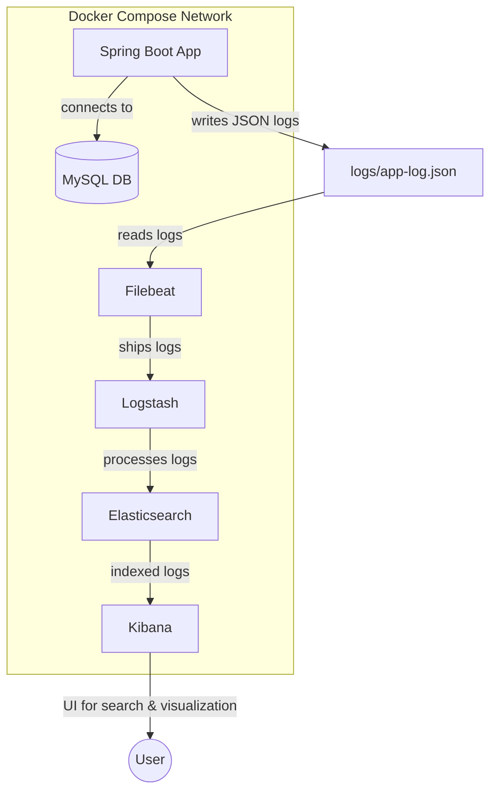

# my-spring-boot-project with ELK

## Summary
This project is a Spring Boot application integrated with a MySQL database and a full ELK (Elasticsearch, Logstash, Kibana) stack for centralized logging and monitoring. It uses Docker Compose to orchestrate all services, including the app, MySQL, Elasticsearch, Logstash, Kibana, and Filebeat. Logs are written in JSON format and shipped to the ELK stack for visualization in Kibana. Filebeat is used to collect and forward application logs to Logstash, enabling real-time log aggregation and analysis. The setup supports both local and Dockerized development, with environment-based configuration and secure credential management.

## MySQL Database Setup

1. Create a `.env` file in your project root with the following content:
   ```env
   MYSQL_USER=user_name
   MYSQL_PASSWORD=MYSQL_USER=user_password
   MYSQL_ROOT_PASSWORD=root_password
   ```

2. The application is configured to use these environment variables for MySQL connection in `src/main/resources/application.properties`:
   ```properties
   spring.datasource.url=jdbc:mysql://mysql:3306/MySpringBootProject
   spring.datasource.username=${MYSQL_USER}
   spring.datasource.password=${MYSQL_PASSWORD}
   spring.datasource.driver-class-name=com.mysql.cj.jdbc.Driver
   spring.jpa.hibernate.ddl-auto=update
   spring.jpa.show-sql=true
   ```

3. MySQL is exposed on host port **3309** and container port **3306**.
4. Spring Boot (in Docker) connects to MySQL using the service name `mysql` and port `3306`.
5. You can connect to MySQL from your host (e.g., MySQL Workbench) using:
   - Host: `localhost`
   - Port: `3309`
   - User: `${MYSQL_USER}` (from your .env file)
   - Password: `${MYSQL_PASSWORD}` (from your .env file)
   - Database: `MySpringBootProject`

## How Connections Work

- **Spring Boot app (Docker Compose):**
  - Connects to MySQL with: `jdbc:mysql://mysql:3306/MySpringBootProject`
  - Uses Docker Compose service networking (host is `mysql`, port is `3306`)
- **Local tools (Workbench, CLI, etc.):**
  - Connect to MySQL with: `localhost:3309`
  - Uses the mapped host port from Docker Compose

## Running with Docker Compose

Docker Compose is used to orchestrate both the Spring Boot application and a MySQL database container.

### Steps:
1. Make sure your `.env` file is present in the project root with the correct credentials.
2. Run the following command to build and start both services:
   ```sh
   ./run-docker.sh
   ```
   This script will:
   - Build the Spring Boot JAR (skipping tests)
   - Remove any existing containers/images with the same name
   - Build and start both the app and MySQL using `docker-compose up --build -d`

3. Access your services:
   - Spring Boot app: [http://localhost:8080](http://localhost:8080)

4. To stop all services:
   ```sh
   docker-compose down
   ```

### docker-compose.yml Overview
- The `mysql` service uses the official MySQL 8.0 image and reads credentials from environment variables.
- The `app` service builds your Spring Boot project and connects to the MySQL service using the service name `mysql` as the host.
- Both services use the same `.env` file for credentials.
- MySQL data is persisted in a Docker volume (`mysql_data`).
- The app will wait for MySQL to be healthy before starting.

## Example .env file
```
MYSQL_USER=user_name
MYSQL_PASSWORD=MYSQL_USER=user_password
MYSQL_ROOT_PASSWORD=root_password
```

## Quick Start
1. Make sure your `.env` file is present in the project root with the correct credentials.
2. Run:
   ```sh
   ./run-docker.sh
   ```
3. Access your app at [http://localhost:8080](http://localhost:8080)
4. Access MySQL from your host at `localhost:3309` with the credentials from `.env`.

## Security Note
- Do not commit your `.env` file to version control. Add it to `.gitignore`.
- For production, consider using a secrets manager or Docker secrets for sensitive credentials.

## Logging and ELK Integration
- Logs are output in JSON format to both the console and `logs/app-log.json`.
- Log rotation and retention are configured in `logback-spring.xml`.

---

This setup allows you to easily run and develop your Spring Boot + MySQL stack locally or in any Docker-compatible environment. It also enables both your Spring Boot app (in Docker) and your local tools to access the same MySQL database, each using the correct port and host.

## Multi-Profile Setup
- **Local profile**: Connects to MySQL running on your Mac.
- **Docker profile**: Connects to MySQL service in Docker Compose.

## ELK Stack & Filebeat Integration (Dockerized)

This project includes a full ELK stack (Elasticsearch, Logstash, Kibana) and Filebeat for centralized log management and visualization.

### How it works
- Spring Boot writes JSON logs to `logs/app-log.json`.
- Filebeat (in Docker) reads these logs and ships them to Logstash.
- Logstash processes and forwards logs to Elasticsearch.
- Kibana provides a UI for searching and visualizing logs at [http://localhost:5601](http://localhost:5601).

### Running Everything
1. Ensure your `.env` file is present in the project root with MySQL credentials.
2. Run:
   ```sh
   ./run-docker.sh
   ```
   This will build and start all services: Spring Boot app, MySQL, Elasticsearch, Logstash, Kibana, and Filebeat.

3. Access services:
   - **App**: [http://localhost:8080](http://localhost:8080)
   - **MySQL**: `localhost:3309` (user: `$MYSQL_USER`, password: `$MYSQL_PASSWORD`)
   - **Kibana**: [http://localhost:5601](http://localhost:5601)
   - **Elasticsearch**: [http://localhost:9200](http://localhost:9200)

4. View logs in Kibana:
   - Go to "Discover" in Kibana and search the `spring-boot-logs-*` index.

### File/Service Overview
- `docker-compose.yml`: Orchestrates all services (app, MySQL, Elasticsearch, Logstash, Kibana, Filebeat).
- `logstash.conf`: Logstash pipeline config for ingesting logs from Filebeat and sending to Elasticsearch.
- `filebeat.yml`: Filebeat config for reading JSON logs and forwarding to Logstash.
- `logs/`: Directory where Spring Boot writes JSON logs (ignored by git).

### Notes
- Elasticsearch data is persisted in the `esdata` Docker volume.
- MySQL data is persisted in the `mysql_data` Docker volume.
- Log files are rotated and retained as configured in `logback-spring.xml`.
- The default log retention is 7 days or 10MB total size.

### Security
- Do not commit your `.env` file to version control.
- For production, consider using a secrets manager or Docker secrets for sensitive credentials.

---

This setup allows you to develop, run, and monitor your Spring Boot app with full log visibility using the ELK stack, all in Docker.

## Architecture Diagram



### Port Reference
- **App**: [http://localhost:8080](http://localhost:8080)
- **MySQL**: `localhost:3309` (user: `$MYSQL_USER`, password: `$MYSQL_PASSWORD`)
- **Kibana**: [http://localhost:5601](http://localhost:5601)
- **Elasticsearch**: [http://localhost:9200](http://localhost:9200)
- **Logstash (host port)**: `localhost:15000` (internal: 5000, for Filebeat)

### Filebeat & Logstash
- Filebeat is configured in `filebeat.yml` to read all JSON logs from `/logs/*.json` and forward them to Logstash at `logstash:5000` (internal Docker network).
- Logstash host port is mapped to `15000` to avoid conflicts, but Filebeat uses the internal port.
